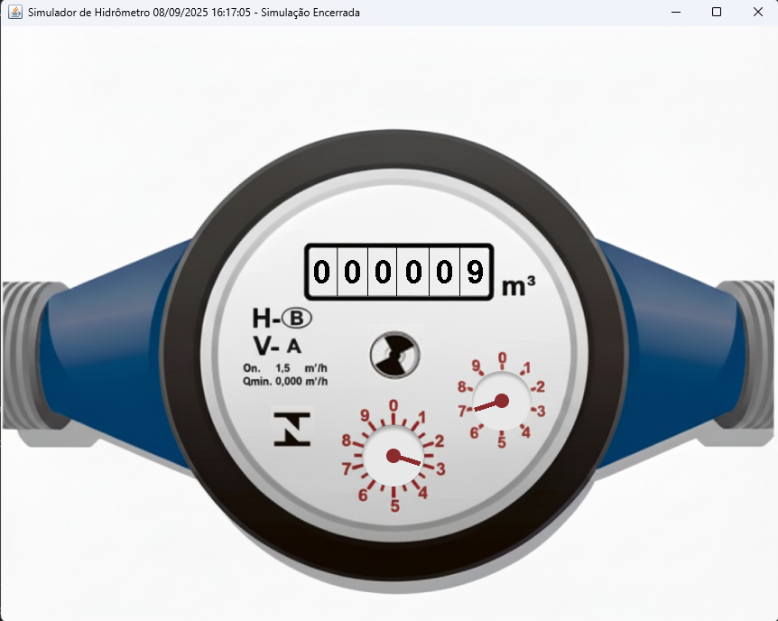
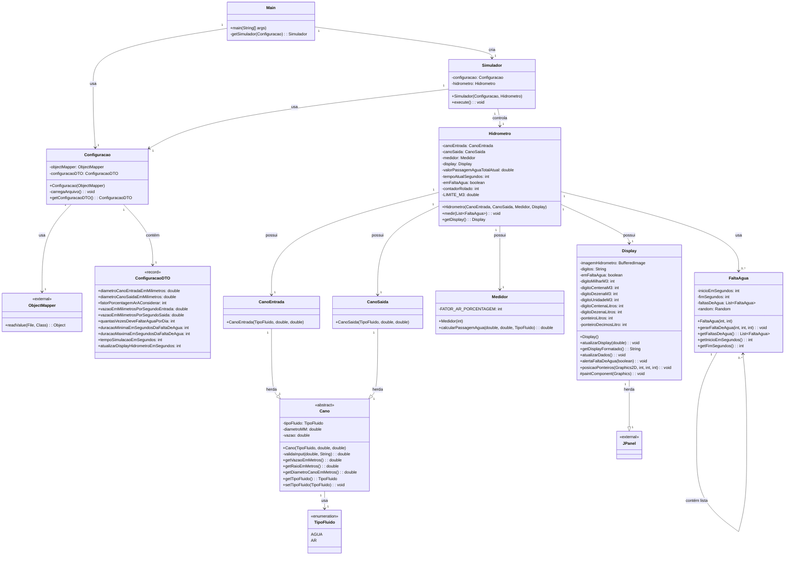

# 🚰 Sistema Hidrômetro v1

Esse é o primeiro projeto da disciplina de Padrões de Projeto do curso de Engenharia de Computação do IFPB campus Campina Grande.

Sistema de simulação de hidrômetro desenvolvido em Java que simula a medição de consumo de água considerando diferentes tipos de fluidos (água ou ar), vazões e eventos como falta d'água.



## 📋 Índice

- [Sobre o Projeto](#sobre-o-projeto)
- [Funcionalidades](#funcionalidades)
- [Estrutura do Projeto](#estrutura-do-projeto)
- [Tecnologias](#tecnologias)
- [Como Executar](#como-executar)
- [Configuração](#configuração)
- [Diagrama UML](#diagrama-uml)
- [Princípios SOLID Aplicados](#princípios-solid-aplicados)
- [Arquitetura do Sistema](#arquitetura-do-sistema)

## 🎯 Sobre o Projeto

O Sistema Hidrômetro é uma aplicação que simula o funcionamento de um hidrômetro real, considerando:
- Medição de consumo através de canos de entrada e saída
- Diferentes tipos de fluidos (água e ar)
- Eventos de falta d'água
- Interface de display para visualização
- Configurações personalizáveis via JSON

## ⚡ Funcionalidades

- ✅ Simulação de medição de consumo de água
- ✅ Suporte a diferentes tipos de fluidos (água/ar)
- ✅ Simulação de eventos de falta d'água
- ✅ Display em tempo real do consumo
- ✅ Configuração flexível via arquivo JSON
- ✅ Cálculo de volume considerando porcentagem de ar

## 📁 Estrutura do Projeto

```
hidrometro_v1/
├── src/
│   ├── main/
│   │   ├── java/br/com/hidrometro/
│   │   │   ├── Main.java                    # Ponto de entrada da aplicação
│   │   │   ├── config/
│   │   │   │   └── Configuracao.java        # Gerenciamento de configurações
│   │   │   ├── core/
│   │   │   │   ├── Simulador.java           # Controle da simulação
│   │   │   │   ├── abstracts/
│   │   │   │   │   └── Cano.java            # Classe abstrata base para canos
│   │   │   │   ├── components/
│   │   │   │   │   ├── CanoEntrada.java     # Implementação do cano de entrada
│   │   │   │   │   ├── CanoSaida.java       # Implementação do cano de saída
│   │   │   │   │   ├── Hidrometro.java      # Componente principal do hidrômetro
│   │   │   │   │   └── Medidor.java         # Lógica de medição
│   │   │   │   ├── events/
│   │   │   │   │   └── FaltaAgua.java       # Simulação de eventos de falta d'água
│   │   │   │   └── ui/
│   │   │   │       └── Display.java         # Interface de usuário
│   │   │   ├── dto/
│   │   │   │   └── ConfiguracaoDTO.java     # Objeto de transferência de dados
│   │   │   └── utils/
│   │   │       └── TipoFluido.java          # Enum para tipos de fluidos
│   │   └── resources/
│   │       └── images/
│   │           └── hidrometro.png           # Recursos visuais
│   └── test/
│       ├── java/                            # Testes unitários
│       └── resources/                       # Recursos para testes
├── config.json                              # Arquivo de configuração
└── README.md                                # Documentação do projeto
```

## 🛠️ Tecnologias

- **Java 21+**
- **Jackson** para processamento JSON
- **Mermaid** para diagramação UML

## 🚀 Como Executar

### **Pré-requisitos:**
- **Java 21+** instalado
- **Git** (para clonar o repositório)

### **Passos para execução:**

1. **Clone o repositório**
   ```bash
   git clone <url-do-repositorio>
   cd hidrometro_v1
   ```

2. **Execute com Gradle Wrapper**
   
   **No Windows:**
   ```cmd
   # Compilar o projeto
   gradlew.bat build
   
   # Executar a aplicação
   gradlew.bat run
   ```
   
   **No Linux/macOS:**
   ```bash
   # Compilar o projeto
   ./gradlew build
   
   # Executar a aplicação
   ./gradlew run
   ```

### **Comandos alternativos:**

```bash
# Limpar builds anteriores
./gradlew clean

# Compilar sem executar testes
./gradlew build -x test

# Executar apenas os testes
./gradlew test

# Gerar documentação
./gradlew javadoc
```

### **Resolução de Problemas:**

#### ❌ **Erro de permissão no Linux/macOS:**
```bash
chmod +x gradlew
./gradlew run
```

#### ❌ **Java não encontrado:**
```bash
# Verificar versão do Java
java -version

# Definir JAVA_HOME se necessário
export JAVA_HOME=/path/to/java21
```

#### ❌ **Dependências não baixadas:**
```bash
# Forçar download das dependências
./gradlew build --refresh-dependencies
```

## ⚙️ Configuração

O sistema utiliza o arquivo `config.json` para configuração dos parâmetros:

```json
{
  "diametroCanoEntradaEmMilimetros": 20.0,
  "diametroCanoSaidaEmMilimetros": 20.0,
  "fatorPorcentagemArAConsiderar": 10,
  "vazaoEmMilimetrosPorSegundoEntrada": 100.0,
  "vazaoEmMilimetrosPorSegundoSaida": 100.0,
  "quantasVezesDeveFaltarAguaPorDia": 0,
  "duracaoMinimaEmSegundosDaFaltaDeAgua": 0,
  "duracaoMaximaEmSegundosDaFaltaDeAgua": 0,
  "tempoSimulacaoEmSegundos": 30,
  "atualizarDisplayHidrometroEmSegundos": 1
}
```

## 📊 Diagrama UML

### Diagrama de Classes




### 📝 Legendas e Convenções

#### 🔗 **Tipos de Relacionamento:**
- **`---->`** Associação/Dependência
- **`--|>`** Herança/Generalização
- **`--o`** Agregação
- **`--*`** Composição

#### 🔢 **Cardinalidades:**
- **`1`** - Exatamente um
- **`0..1`** - Zero ou um (opcional)
- **`0..*`** - Zero ou muitos
- **`1..*`** - Um ou muitos

#### 🏷️ **Estereótipos:**
- **`<<abstract>>`** - Classe abstrata
- **`<<enumeration>>`** - Enumeração
- **`<<record>>`** - Record do Java
- **`<<external>>`** - Dependência externa

#### 👁️ **Visibilidade:**
- **`+`** - Público
- **`-`** - Privado
- **`#`** - Protegido
- **`~`** - Pacote

### 🔍 **Principais Relacionamentos Explicados:**

1. **Main (1) → Configuracao (1)**: Uma instância do Main utiliza exatamente uma instância de Configuracao
2. **Hidrometro (1) → Display (1)**: Cada hidrômetro possui exatamente um display
3. **Hidrometro (1) → FaltaAgua (0..*)**: Um hidrômetro pode processar zero ou muitos eventos de falta d'água
4. **Display (1) --|> JPanel (1)**: Display herda de JPanel (herança de biblioteca externa)
5. **FaltaAgua (1) → FaltaAgua (0..*)**: Uma instância FaltaAgua gerencia uma lista de eventos

## 🏗️ Princípios SOLID Aplicados

### **Single Responsibility Principle (SRP)**
- ✅ `ConfiguracaoDTO`: Apenas armazena dados
- ✅ `Configuracao`: Apenas gerencia carregamento de configuração
- ✅ `Medidor`: Apenas calcula passagem de água
- ✅ `Display`: Apenas apresenta informações visuais

### **Open/Closed Principle (OCP)**
- ✅ `Cano`: Aberto para extensão (novos tipos), fechado para modificação
- ✅ `TipoFluido`: Fácil adição de novos tipos de fluidos

### **Liskov Substitution Principle (LSP)**
- ✅ `CanoEntrada` e `CanoSaida` podem substituir `Cano` sem quebrar funcionalidade

### **Interface Segregation Principle (ISP)**
- ✅ Classes não dependem de métodos que não utilizam
- ✅ `ObjectMapper` usado apenas onde necessário

### **Dependency Inversion Principle (DIP)**
- ✅ `Configuracao` depende da abstração `ObjectMapper`, não de implementação concreta
- ✅ `Hidrometro` composto por abstrações (interfaces conceituais)

## 🏛️ Arquitetura do Sistema

### **Camadas da Aplicação:**

1. **Camada de Apresentação (`ui/`)**
   - `Display.java` - Interface gráfica do hidrômetro
   - Responsável pela visualização e interação com usuário

2. **Camada de Negócio (`core/`)**
   - `Hidrometro.java` - Lógica principal do sistema
   - `Medidor.java` - Algoritmos de cálculo
   - `Simulador.java` - Controle de simulação

3. **Camada de Dados (`config/`, `dto/`)**
   - `Configuracao.java` - Acesso a configurações
   - `ConfiguracaoDTO.java` - Estrutura de dados

4. **Camada de Domínio (`abstracts/`, `components/`)**
   - `Cano.java` - Modelagem abstrata
   - `CanoEntrada.java`, `CanoSaida.java` - Implementações específicas

### **Fluxo de Dados:**
```
config.json → Configuracao → ConfiguracaoDTO → Main → Simulador → Hidrometro → Display
```

## 📝 Responsabilidades das Classes

### 🔧 Core Components
- **Hidrometro:** Coordena a medição de consumo e integra todos os componentes
- **Medidor:** Executa cálculos de volume baseado nos canos de entrada e saída
- **Display:** Apresenta informações do consumo ao usuário
- **Cano (Abstract):** Define comportamento base para os canos do sistema

### ⚙️ Configuration
- **Configuracao:** Gerencia carregamento, validação e acesso aos dados de configuração
- **ConfiguracaoDTO:** Contém todos os parâmetros de configuração do sistema (dados puros)

### 🎯 Events
- **FaltaAgua:** Simula cenários realistas de interrupção no fornecimento

### 🎮 Simulation
- **Simulador:** Controla o fluxo temporal e execução da simulação
- **Main:** Inicializa e coordena toda a aplicação

### 🛠️ Utilities
- **TipoFluido:** Define tipos de fluidos

---

*Desenvolvido como projeto para a disciplina de Padrões de Projeto em Java 21+*
